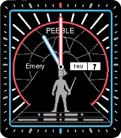

# Citizen Star Wars — Pebble Watchface

A Pebble Time 2 (Emery) watchface inspired by the Citizen Star Wars Eco-Drive watch, featuring lightsaber hands, a cockpit dial face, and Luke Skywalker.



## Features

- Blue (hour) and red (minute) lightsaber hands
- Cockpit instrument dial face
- Luke Skywalker silhouette
- Red arc ring with 12 o'clock marker
- Live day/date display

## Platform

- **Target:** Emery (Pebble Time 2, 200×228)

## Build

```bash
pebble build
pebble install --emulator emery
```
